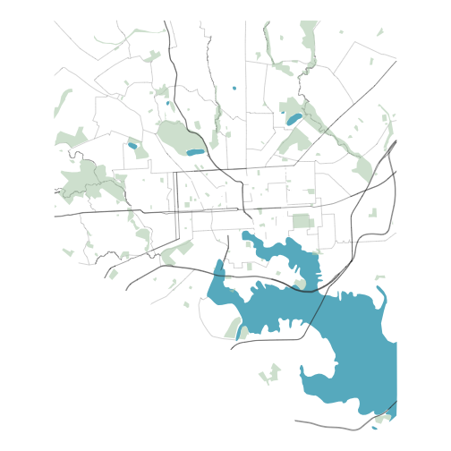
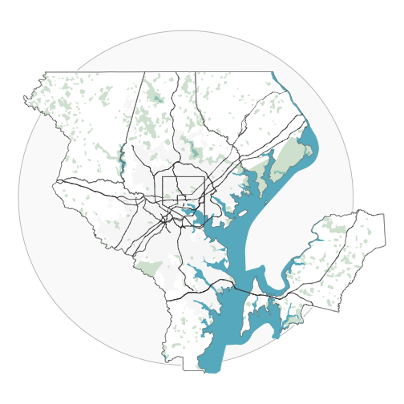

<!-- README.md is generated from README.Rmd. Please edit that file -->


# tigris-basemap

<!-- badges: start -->
[](https://lifecycle.r-lib.org/articles/stages.html#experimental)
[](https://opensource.org/licenses/MIT)
[](https://www.repostatus.org/#concept)
<!-- badges: end -->

The goal of tigris-basemap is to share a reproducible data pipeline (RAP) built with `{targets}` and `{tigris}` for creating static basemaps of counties and metropolitan areas in the United States of America using spatial data from the Census Bureau and USGS.

At present this pipeline relies on development versions of both `{tigris}` and `{arcgislayers}`. These can be installed using `{pak}` or `{devtools}`:


```r
pak::pkg_install("elipousson/tigris")
pak::pkg_install("elipousson/arcgislayers")
```

Here is an example of a county map created with this pipeline:


```r
targets::tar_read_raw("county_basemap")
```



This map does not include the outside border of the county as it is intended to be used in combination with a data layer and then county boundary applied as a foreground layer.

Here is an example of a regional map created with this pipeline:


```r
targets::tar_read_raw("msa_basemap")
```



The design of both maps are created for use in Baltimore City, Maryland and the Baltimore-Columbia-Towson, MD Metro Area. The pipeline works with other counties and metro areas but has not been tested extensively and likely will not work with all geographies. 
 
